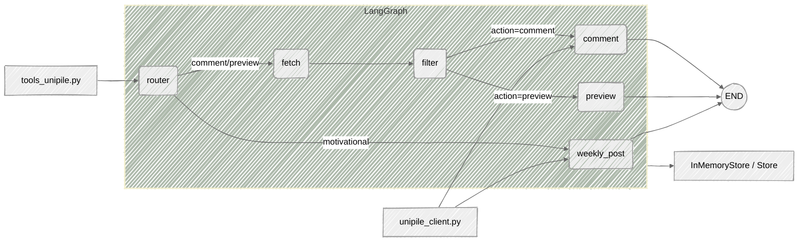

# LinkedIn Comment & Post Agent 🚀

Vision
------
This project exists because LinkedIn can be a grind — commenting and posting feels tedious. I built an agent to automate thoughtful, human-like comments and occasional motivational posts so you can focus on building instead of social chores. The agent uses LangGraph for flow control, a Groq-backed LLM (`langchain_groq`), and a small Unipile client to interact with LinkedIn.

Highlights ✨
- 💬 Automated comment generation inspired by post content (LLM-driven)
- 🔎 Relevance filtering to decide which posts are worth commenting on
- ✅ Safe posting with daily limits, random human-like delays, and seen-post tracking
- 🧭 Built with LangGraph state machine so workflows are explicit and extensible
- 🗄️ In-memory store by default; can be swapped to a persistent store

Quickstart
----------
1. Clone the repo and enter the project folder:

```bash
gh repo clone cyborgsuh/LinkedIn-Comment---Post-Agent
cd "linkedin comments and post agent"
```

2. Create and activate a Python virtual environment (Windows example):

```powershell
python -m venv .venv
& .venv\Scripts\Activate.ps1
pip install -r requirements.txt
```

3. Create a `.env` file in the project root with your keys (example):

```
GROQ_API_KEY=your_groq_api_key_here
LINKEDIN_UNIPILE_ACCOUNT_ID=your_unipile_account_id
UNIPILE_DSN=your_unipile_DSN
UNIPILE_API_KEY=your_unipile_api
```

4. Run the agent CLI:

```bash
python graph.py
```

Commands 🛠️
- `comment latest` — Search LinkedIn (AI-suggested keywords), filter relevant posts, and comment on them respecting limits.
- `preview latest` — Search and print relevant posts without commenting.
- `motivational post` — Create and publish a motivational post (skips search flow). ✨
- `exit` — Quit the CLI.

How the pieces fit
-------------------
- `graph.py` — LangGraph workflow: routes commands, optionally fetches posts, filters, and either comments or previews. Compiled with an `InMemoryStore` by default so the graph can read/write cross-thread memory.
- `tools_unipile.py` — Search, filter, LLM prompt templates, and safe posting helpers (comment & post). 
- `unipile_client.py` — Lightweight wrapper around API calls to Unipile/LinkedIn (search, comment, create post).

Agent DAG (Mermaid)
--------------------



Environment variables
---------------------
- `GROQ_API_KEY` — Groq LLM API key used by `langchain_groq`.
- `LINKEDIN_UNIPILE_ACCOUNT_ID` — Account identifier for posting via Unipile.
- `UNIPILE_API_KEY` or other Unipile credentials as required by your `unipile_client.py` implementation.

Recommended workflow for testing
--------------------------------
1. Set `DRY_RUN=True` in `tools_unipile.py` while testing to avoid making real API calls.
2. Use small `MAX_COMMENTS_PER_DAY` to limit accidental runs.
3. Test `preview latest` first to see which posts would be commented on.

Enhancements & Roadmap
----------------------
Short-term improvements
- Improve prompts for more human-like, insightful, and engaging comments.
- Add dynamic tone selection (e.g., humorous, motivational, reflective).
- Experiment with different LLM models or embedding providers for relevance filtering.

Persistence & scaling
- Track full comment history (text + timestamp) instead of just `seen_posts`.
- Store metadata like reaction counts, post author, and original post timestamp.
- Implement persistence via a database (SQLite for local dev, Postgres/Redis for production).

Scheduling & automation
- Add a background scheduler or cron job for posting/commenting at optimal times.

Advanced filtering & ranking
- Rank posts by engagement (likes, comments) or a relevance score.
- Use semantic search (embeddings) for matching posts and memories instead of keyword-only search.
- Add spam/low-quality filter (heuristics or classifier) to avoid low-value posts.

### Interactive & learning features 🤖

- Natural Language Commands — Tell the agent what kind of post or comment you want (e.g., "Write a short reflective comment about this thread" or "Post a motivational update about building in AI"). 💬
- Auto-Generate Drafts — The agent generates draft posts/comments from your command for review. 📝
- Human-in-the-Loop Approval — Present generated drafts to a human for review and edits before posting. ✍️
- Automated Posting — After approval, the agent posts automatically; optional scheduling can queue approved drafts for later. ⏰
- Context Retention — Remember previous commands, user preferences, and approved drafts to personalize future suggestions. 🧠
- Feedback Loop & Self-Improvement — Track approvals/rejections and use this feedback to refine prompts and selection criteria, improving relevance over time. 🔁


Contributing
------------
Contributions welcome. Suggested steps:

1. Open an issue describing the feature or bug.
2. Fork, create a feature branch, and submit a PR with tests where applicable.

Potential contribution ideas
- See the [**Enhancements & Roadmap**](#enhancements--roadmap) section above for ideas and priorities (short-term improvements, persistence & scaling, scheduling, advanced filtering, interactive features).

Troubleshooting
---------------
- If Groq LLM calls fail, confirm `GROQ_API_KEY` is set and `load_dotenv()` is called before any `ChatGroq` instances are created.

License
-------
This project is licensed under the MIT License — see [LICENSE](LICENSE) for details.

Acknowledgements 🙏
----------------
Built with LangGraph, LangChain integrations, and a small Unipile client for LinkedIn interactions.

